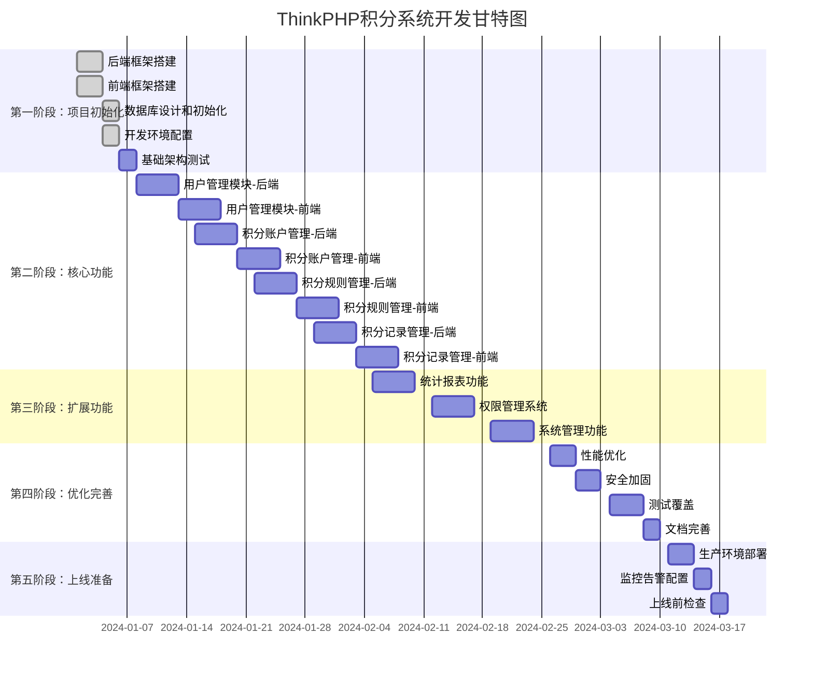

# ThinkPHP积分系统 - 开发路线图

## 开发里程碑

### 🎯 Milestone 1: 项目就绪 (Week 1-2)
**目标**：开发环境搭建完成，可以开始功能开发

**交付物**：
- ✅ 后端框架（ThinkPHP 8.0）运行正常
- ✅ 前端框架（Vue 3 + Vite）运行正常
- ✅ 数据库表结构创建完成
- ✅ 开发文档齐全
- ✅ Git工作流建立

**验收标准**：
- 能够正常启动前后端服务
- 数据库连接正常
- 能够成功调用测试API

---

### 🎯 Milestone 2: 核心功能完成 (Week 3-6)
**目标**：用户和积分核心功能开发完成

**交付物**：
- ✅ 用户管理（增删改查、导入导出）
- ✅ 积分账户（查询、冻结、等级）
- ✅ 积分规则（配置、管理）
- ✅ 积分记录（发放、扣除、查询）

**验收标准**：
- 所有核心API接口可用
- 前端界面功能完整
- 单元测试通过
- 可进行完整业务流程演示

---

### 🎯 Milestone 3: 功能完整 (Week 7-9)
**目标**：扩展功能开发完成

**交付物**：
- ✅ 统计报表（概览、图表、排行榜）
- ✅ 权限管理（角色、权限、分配）
- ✅ 系统管理（日志、配置）

**验收标准**：
- 所有计划功能已实现
- 前端界面美观易用
- 数据统计准确
- 权限控制有效

---

### 🎯 Milestone 4: 质量达标 (Week 10-11)
**目标**：系统优化完成，达到上线标准

**交付物**：
- ✅ 性能优化（响应时间<500ms）
- ✅ 安全加固（通过安全扫描）
- ✅ 测试覆盖（核心功能测试覆盖率>80%）
- ✅ 文档完善（用户手册、运维文档）

**验收标准**：
- 性能测试达标
- 安全扫描无高危漏洞
- 测试用例通过率100%
- 文档完整可用

---

### 🎯 Milestone 5: 生产就绪 (Week 12)
**目标**：系统上线

**交付物**：
- ✅ 生产环境部署
- ✅ 监控告警配置
- ✅ 数据备份方案
- ✅ 上线文档

**验收标准**：
- 生产环境稳定运行
- 监控数据正常
- 备份恢复可用
- 上线检查清单全部通过

---

## 技术债务管理

### 已知技术债务
暂无（新项目）

### 需要关注的风险点
1. **性能风险**：大数据量查询可能影响性能
   - 缓解措施：合理索引、分表策略、缓存
   
2. **并发风险**：高并发积分操作可能数据不一致
   - 缓解措施：乐观锁、分布式锁、消息队列

3. **安全风险**：积分作弊、恶意刷分
   - 缓解措施：规则限制、行为检测、风控系统

---

## 版本规划

### V0.1 - MVP版本 (Week 1-5)
**功能**：
- 基础用户管理
- 简单积分发放
- 基础规则配置

**目标用户**：内部测试

---

### V1.0 - 正式版本 (Week 6-10)
**功能**：
- 完整用户管理
- 完整积分系统
- 统计报表
- 权限管理

**目标用户**：正式用户

---

### V1.1 - 优化版本 (Week 11-12)
**功能**：
- 性能优化
- 用户体验优化
- 移动端适配

**目标用户**：正式用户

---

### V2.0 - 扩展版本 (未来)
**计划功能**：
- 积分商城
- 积分转让
- 第三方API
- 多租户支持

---

## 发布检查清单

### 代码质量
- [ ] 代码审查完成
- [ ] 单元测试通过
- [ ] 集成测试通过
- [ ] 代码覆盖率达标
- [ ] 无已知严重Bug

### 性能
- [ ] 接口响应时间<500ms
- [ ] 并发测试通过（1000 TPS）
- [ ] 数据库查询优化
- [ ] 静态资源CDN加速

### 安全
- [ ] SQL注入测试通过
- [ ] XSS攻击测试通过
- [ ] CSRF防护启用
- [ ] 敏感数据加密
- [ ] 安全扫描通过

### 文档
- [ ] API文档完整
- [ ] 用户手册完成
- [ ] 部署文档完成
- [ ] 运维文档完成
- [ ] 变更日志更新

### 运维
- [ ] 监控配置完成
- [ ] 日志收集配置
- [ ] 告警规则设置
- [ ] 备份策略实施
- [ ] 回滚方案准备

### 其他
- [ ] 演示环境准备
- [ ] 培训材料准备
- [ ] 发布公告准备
- [ ] 客户支持准备

---

## 团队协作

### 角色分工
- **后端开发**：负责API接口、数据库、业务逻辑
- **前端开发**：负责UI界面、交互体验、前端逻辑
- **测试**：负责测试用例、质量保证、Bug跟踪
- **运维**：负责环境搭建、部署上线、监控运维
- **产品**：负责需求管理、优先级排序、验收确认

### 沟通机制
- **每日站会**：15分钟，同步进度和问题
- **周例会**：1小时，回顾本周工作，计划下周任务
- **代码审查**：每个PR必须经过审查
- **文档更新**：功能开发完成后及时更新文档

### 工具使用
- **代码管理**：Git + GitHub
- **项目管理**：GitHub Projects / Jira
- **文档协作**：Markdown + GitHub Wiki
- **沟通工具**：钉钉/微信/Slack
- **设计工具**：Figma / Sketch

---

## 持续改进

### 技术改进方向
1. **性能优化**
   - 引入Redis集群
   - 实现读写分离
   - 使用消息队列

2. **架构升级**
   - 微服务化改造
   - 服务容器化
   - 云原生部署

3. **功能增强**
   - AI智能推荐
   - 大数据分析
   - 移动端App

### 流程改进
1. **开发流程**
   - 完善CI/CD流程
   - 自动化测试
   - 灰度发布

2. **运维流程**
   - 自动化运维
   - 容器编排
   - 弹性伸缩

---

## 参考资料

- [项目总结报告](./PROJECT_SUMMARY.md)
- [开发规划详细文档](./DEVELOPMENT_PLAN.md)
- [API接口设计](./API_DESIGN.md)
- [快速开始指南](./QUICK_START.md)

---

**最后更新**：2024-02-02
**文档版本**：v1.0
